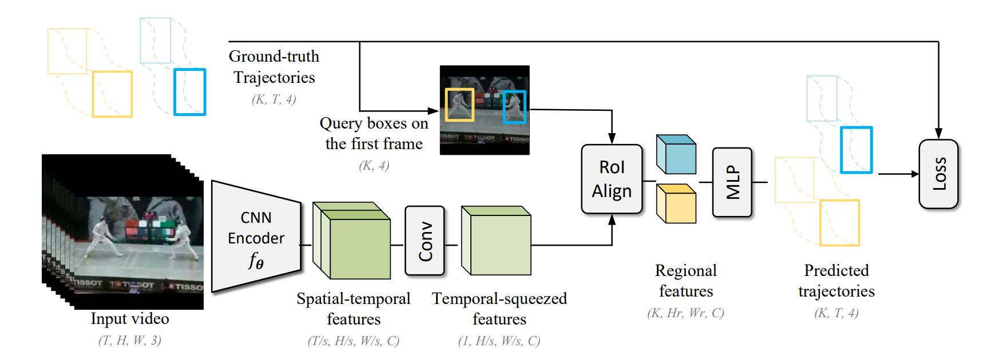

## Unsupervised Video Representation Learning by Catch-the-Patch

### Introduction

This is the codebase for the paper ""**Unsupervised Visual Representation Learning by Tracking Patches in Video**" (CVPR'21).




### Getting Started

#### Installation

You can install some necessary libraries by either conda or Docker.

* Conda (or  virtualenv)

  ```bash
  # Step 0, create a new python environment
  conda create -n ctp python=3.7
  conda activate ctp
  
  # Step 1, install PyTorch (please select a suitable CUDA version)
  conda install pytorch torchvision cudatoolkit=10.1 -c pytorch
  
  # Step 2, install mmcv library
  git clone https://github.com/open-mmlab/mmcv.git
  cd mmcv
  MMCV_WITH_OPS=1 pip install -e .
  # one can also install pre-built binary file (full-version), please refer to the official repo, https://github.com/open-mmlab/mmcv
  
  # Step 3, (optional) install tensorboard
  pip install tensorboard
  ```

* Docker

  Please refer to `docker/Dockerfile`.


#### Data Preparation

In our implementation, we save each video into a .zip file. For example, in UCF-101, `ApplyEyeMakeup/v_ApplyEyeMakeup_g01_c01.zip` file contains a series of decoded jpeg images: `img_00001.jpg`, `img_00002.jpg`, ...

See details in `docs/data_preparation.md`.

You can alternatively implement your own storage backend, as like `pyvrl/datasets/backends/zip_backend.py`


#### CtP Pretraining

All of our experiments use single-node distributed training. For example, if you wants to pretrain a CtP model on UCF-101 dataset:

```bash
bash tools/dist_train.sh configs/ctp/r3d_18_ucf101/pretraining.py 8 --data_dir /video_data/
```

The checkpoint will be saved in the `work_dir` entry defined in the configuration file.


#### Action Recognition

When finish pretraining, one can use the CtP-pretrained model to initialize the action recognizer. The checkpoint path is defined in the key of `model.backbone.pretrained`.

**Model Training (with validation):**

```bash
bash tools/dist_train.sh configs/ctp/r3d_18_ucf101/finetune_ucf101.py 8 --data_dir /video_data/ --validate
```

**Model evaluation:**

```bash
bash tools/dist_test.sh configs/ctp/r3d_18_ucf101/finetune_ucf101.py --gpus 8 --data_dir /video_data/ --progress
```

